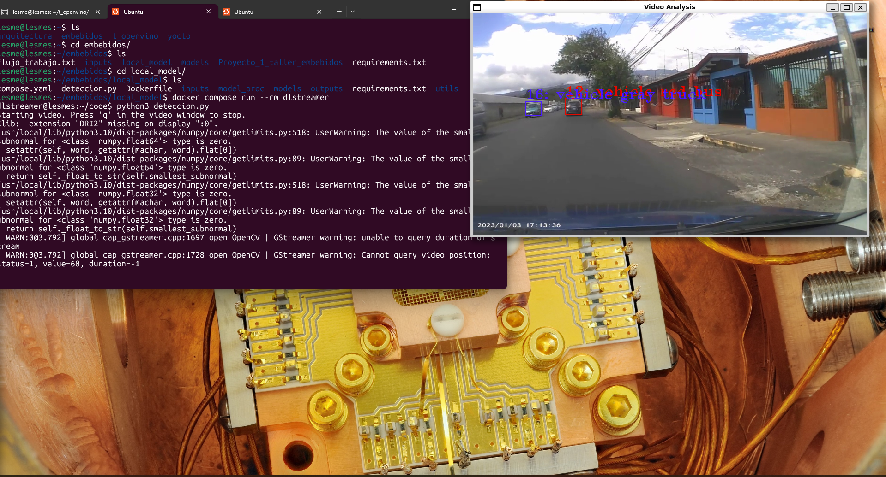
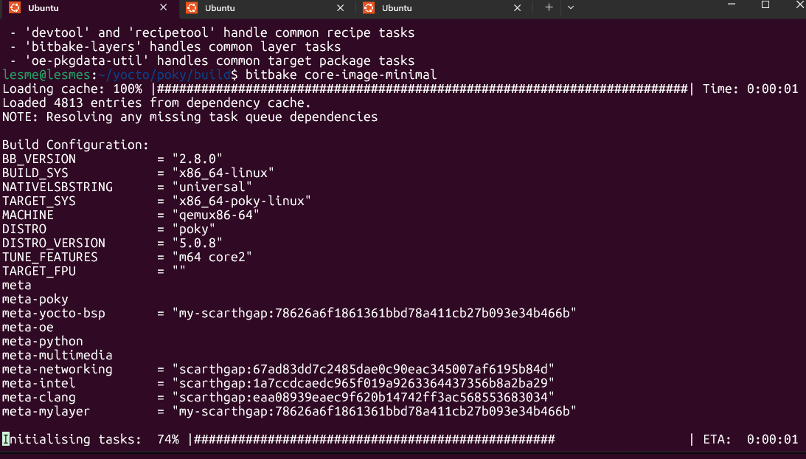
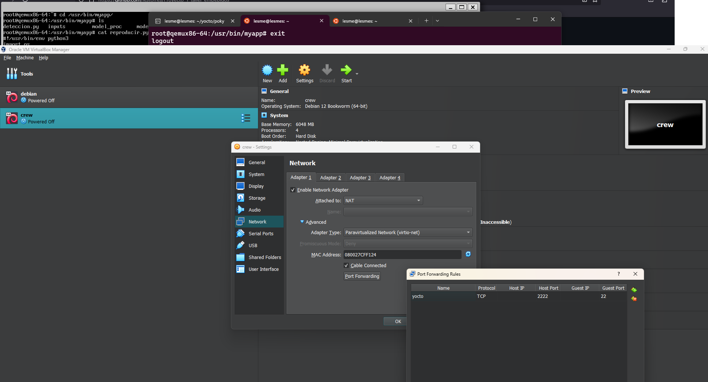
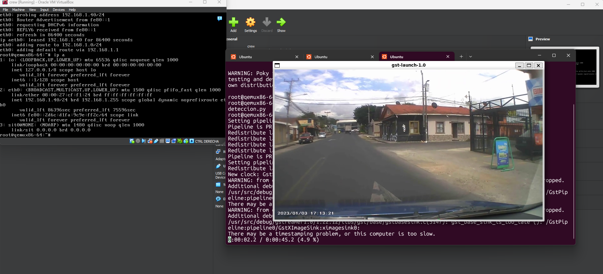

# Proyecto 1: Sistema operativo a la medida 
El objetivo del proyecto es desarrollar un sistema operativo a la medida para  aplicaciones embebidas de multimedia con el marco de trabajo de Intel DLStreamer y el flujo de síntesis de Yocto Project

## Aplicación Elegida: 
**Aplicación elegida**: Vehicle and pedestrian tracking using Intel Openvino + DLStreamer and Docker.

**Problematica a resolver**: Integración Intel Openvino + DLStreamer y Yocto Project para la detección de vehículos y personas implementado en cámaras dashcam de vehículos.

## Descripción del proyecto
El proyecto consta de 2 secciones: 
- El desarrollo de la aplicación en un contenedor mediante Docker.
- El desarrollo de la aplicación en un sistema operativo a la medida mediante YoctoProject.

Dentro del tutorial se encontrará el paso a paso en el flujo de desarrollo de ambas presentaciones de la aplicación.

**Nota:** La integración de Dlstreamer dentro del sistema operativo a la medida mediante YoctoProject aún **NO** se encuentra disponible.


# Tutorial

### Descripción del Computador Host
El desarrollo del proyecto se realizó en un entorno virtualizado utilizando Ubuntu 24.04.2 LTS bajo WSL2 (Windows Subsystem for Linux) sobre una máquina host con Windows 11. A continuación, se describen las especificaciones relevantes del computador:

- **Fabricante:** Acer
- **Modelo:** Predator PHN16-71
- **Sistema operativo:** Microsoft Windows 11 Home, versión 10.0.26100 Build 26100
- **Procesador:** Intel Core i5-13500HX de 13ª generación, 14 núcleos físicos, 20 hilos, frecuencia base de 2.5 GHz
- **Memoria RAM instalada:** 16 GB
- **Tipo de sistema:** PC basado en x64
- **Modo de BIOS:** UEFI
- **Virtualización:** Seguridad basada en virtualización activa
- **Estado de Secure Boot:** Activado

**Entorno de desarrollo - Ubuntu (WSL2):**
- **Distribución:** Ubuntu 24.04.2 LTS sobre Windows 11 vía WSL2
- **Kernel:** 5.15.167.4-microsoft-standard-WSL2
- **Shell:** Bash 5.2.21
- **Número de paquetes instalados:** 1483 (`dpkg`)
- **Memoria disponible al momento del escaneo:** 463 MiB / 15.7 GiB
- **Tema e íconos:** Adwaita (GTK3)
- **GPU (virtual):** Microsoft Basic Render Driver (limitado en WSL2)

## Configuración del Entorno: Contenedor Docker

### Prerequisitos para la Configuración del Entorno: Contenedor Docker
Como prerequisito se debe clonar el repositorio Proyecto_1_taller_embebidos e instalar Docker

* [Docker](https://docs.docker.com/engine/install/ubuntu/)

### Estructura de archivos para el contenedor Docker y pasos a seguir

```plaintext
local_model/
│
├── compose.yaml
├── deteccion.py
├── Dockerfile
├── model_proc/
├── models/
├── inputs/
├── outputs/
└── utils/

```
El directorio local_model basado en [1], incluye dentro los archivos: **compose.yaml** y **Dockerfile** estos configuran el entorno necesario para la aplicación, esta se encuentra dentro del script deteccion.py, que utiliza los modelos incluidos en le directorio models y sus scripts dentro de model_proc.


Utilizando una terminal Linux dentro del directorio local_model, los pasos a seguir son: 
1. Contruir el contenedor Docker de la aplicación.

```plaintext
docker compose build dlstreamer
```
2. Levantar el contenedor Docker con una terminal habilitada.
   
```plaintext
docker compose run --rm dlstreamer
```
3. Una vez levantado el docker con su terminal, se debe ejecutar el script de la siguiente manera.

```plaintext
python3 deteccion.py
```
A este punto la aplicación debe mostrar lo siguiente: 

<p align="center">
  
</p>

## Configuración del Entorno: Imagen minima YoctoProject

---
###  Target del Proyecto

- **Tipo de sistema:** Máquina virtual x86 (VirtualBox)
- **Sistema operativo de destino:** Imagen Linux generada con Yocto Project
- **Imagen base utilizada:** `core-image-minimal` personalizada
- **Componentes integrados:**
  - Aplicación Python con inferencia de modelo (OpenVINO™)
  - Dependencias del sistema (bibliotecas de Python, OpenCV, etc.)
  - Modelo preentrenado seleccionado desde OpenVINO™ Model Zoo
- **Propósito:** Ejecutar la aplicación final de procesamiento multimedia en un entorno controlado y reproducible
---

### Prerequisitos del sistema
Según la documentación de YoctoProject [2] se requiere:
- **Espacio en disco:** al menos **90 GB** libres (más espacio mejora el rendimiento en múltiples builds).
- **Memoria RAM:** al menos **8 GB** 
- **Distribución Linux compatible:**  Ubuntu / Debian Fedora / openSUSE / CentOS
- Además de las herramientas:

| Herramienta     | Versión mínima |
|------------------|----------------|
| Git              | 1.8.3.1        |
| tar              | 1.28           |
| Python           | 3.8.0          |
| GCC              | 8.0            |
| GNU Make         | 4.0            |


### Configuración del Entorno: Imagen minima pasos a seguir
1) Clonar e ingresar al directorio  `poky`

```plaintext
git clone git://git.yoctoproject.org/poky
cd poky
```

2) Cambiar a la rama de scarthgap y hacer pull:
   
 ```plaintext
$ git branch -a
```

```plaintext
git checkout -t origin/scarthgap -b my-scarthgap
```

```plaintext
git pull
```
### Estructura de archivos de los contenidos básicos de poky (Por defecto)

```plaintext
yocto/
│
├── bitbake/                       # Motor de construcción BitBake
├── build/                         # Directorio de trabajo (generado tras ejecutar oe-init-build-env)
├── documentation/                 # Documentación de Poky y Yocto Project
├── meta/                          # Meta-capa principal de OpenEmbedded-Core (recetas base)
├── meta-poky/                     # Configuración y contenido base de Poky
├── meta-selftest/                 # Pruebas automáticas para verificar integridad de recetas y configuraciones
├── meta-skeleton/                 # Plantillas básicas para crear recetas y capas
├── meta-yocto-bsp/                # Soporte de Board Support Packages (BSPs)
├── oe-init-build-env              # Script para inicializar el entorno de construcción
└── README*.md                     # Documentacion
```

### Dependencias de la capa OpenVino y meta-mylayer
La documentación de intel para OpenVino [3] indica los siguientes pasos para su instalación:

1) Clonar los repositorios dentro de poky.
```plaintext
git clone https://git.yoctoproject.org/meta-intel
git clone https://git.openembedded.org/meta-openembedded
git clone https://github.com/kraj/meta-clang.git
```

1.2 Cambiar a la rama de scarthgap y hacer pull en cada uno de los repositorios clonados:
   
 ```plaintext
$ git branch -a
```

```plaintext
git checkout -t origin/scarthgap -b my-scarthgap
```

2. Añadir las capas requieridas dentro del entorno `oe-init-build-env`.

```plaintext
source poky/oe-init-build-env
```

```plaintext
bitbake-layers add-layer ../meta-intel
bitbake-layers add-layer ../meta-openembedded/meta-oe
bitbake-layers add-layer ../meta-openembedded/meta-python
bitbake-layers add-layer ../meta-openembedded/meta-multimedia
bitbake-layers add-layer ../meta-openembedded/meta-networking
bitbake-layers add-layer ../meta-clang
```
3. Comprobar la correcta instalacion de las capas.
```plaintext
bitbake-layers show-layers
```
La salida esperada:

```plaintext
NOTE: Starting bitbake server...
layer                 path                                                                    priority
========================================================================================================
core                  /home/laptop/yocto/poky/build/../meta                                    5
yocto                 /home/laptop/yocto/poky/build/../meta-poky                               5
yoctobsp              /home/laptop/yocto/poky/build/../meta-yocto-bsp                          5
openembedded-layer    /home/laptop/yocto/poky/build/../meta-openembedded/meta-oe               5
meta-python           /home/laptop/yocto/poky/build/../meta-openembedded/meta-python           5
multimedia-layer      /home/laptop/yocto/poky/build/../meta-openembedded/meta-multimedia       5
networking-layer      /home/laptop/yocto/poky/build/../meta-openembedded/meta-networking       5
intel                 /home/laptop/yocto/poky/build/../meta-intel                              5
clang-layer           /home/laptop/yocto/poky/build/../meta-clang                              7
```

4) A este punto se debe añadir la capa con todo lo necesario para la capa de la aplicacion y se hace de la siguiente manera:
- Desde el directorio "/home/laptop/yocto/poky/" y con el entorno activado "source poky/oe-init-build-env":

```plaintext
bitbake-layers create-layer meta-mylayer
```
Se generará la siguiente estructura

```plaintext
meta-mylayer/
├── conf/
│   └── layer.conf
└── README
```
5. Sobre el directorio meta-mylayer se debe copiar la capa "meta-mylayer" del repositorio de git Proyecto_1_taller_embebidos, de forma que sea: 

```plaintext
meta-mylayer/
      ├── conf/
            └── layer.conf
      ├── COPYING.MIT
      ├── README
      └── recipes-myproject/
             └── myapp/
                     ├── myapp_1.0.bb
                     └── files/
                            ├── deteccion.py
                            ├── reproducir.py
                            ├── inputs/
                            ├── model_proc/
                            ├── models/
                            └── utils/
```
Ahora se debe verificar nuevamente
```plaintext
bitbake-layers show-layers
```
La salida esperada:

```plaintext
NOTE: Starting bitbake server...
layer                 path                                                                    priority
========================================================================================================
core                  /home/laptop/yocto/poky/build/../meta                                    5
yocto                 /home/laptop/yocto/poky/build/../meta-poky                               5
yoctobsp              /home/laptop/yocto/poky/build/../meta-yocto-bsp                          5
openembedded-layer    /home/laptop/yocto/poky/build/../meta-openembedded/meta-oe               5
meta-python           /home/laptop/yocto/poky/build/../meta-openembedded/meta-python           5
multimedia-layer      /home/laptop/yocto/poky/build/../meta-openembedded/meta-multimedia       5
networking-layer      /home/laptop/yocto/poky/build/../meta-openembedded/meta-networking       5
intel                 /home/laptop/yocto/poky/build/../meta-intel                              5
clang-layer           /home/laptop/yocto/poky/build/../meta-clang                              7
meta-mylayer          /home/lesme/yocto/poky/meta-mylayer                                      6     --> La capa de la aplicación..!!
```

**Nota:** A este punto debería implementarse la capa de Dlstreamer que añade funciones a Gstreamer requeridas para la correcta ejecución de la aplicación, 
actualmente no existe una capa de dlstreamer oficial, por lo que no se implementó, lo que conlleva a futuro la labor de crearla de manera manual, con todos
los retos asociados tanto de dependencias como de compilación para un entorno de YoctoProject de imagen mínima [4].

### Estructura de archivos de los contenidos importantes en Yocto Project completo 
Para este punto debería estar esta estructura de directorios: 
```plaintext
yocto/
│
├── bitbake/                       # Motor de construcción BitBake
├── build/                         # Directorio de trabajo (generado tras ejecutar oe-init-build-env)
├── contrib/                       # Scripts y herramientas de la comunidad
├── documentation/                 # Documentación de Poky y Yocto Project
├── meta/                          # Meta-capa principal de OpenEmbedded-Core (recetas base)
├── meta-clang/                    # Soporte para compilador Clang/LLVM
├── meta-intel/                    # Capas para plataformas Intel
├── meta-mylayer/                  # Capa personalizada
│   ├── conf/                        # Configuración de la capa
│   │   └── layer.conf               # Definición de la capa
│   └── recipes-myproject/           # Recetas de del proyeto
├── meta-openembedded/             # Conjunto de capas adicionales de OpenEmbedded
├── meta-poky/                     # Configuración y contenido base de Poky
├── meta-selftest/                 # Pruebas automáticas para verificar integridad de recetas y configuraciones
├── meta-skeleton/                 # Plantillas básicas para crear recetas y capas
├── meta-yocto-bsp/                # Soporte de Board Support Packages (BSPs)
├── oe-init-build-env              # Script para inicializar el entorno de construcción
├── scripts/                       # Scripts de ayuda para tareas del sistema Yocto
├── README*.md                     # Documentación adicional
└── SECURITY.md, LICENSE*, etc.    # Archivos legales y de seguridad
```

7. Como último paso, en el directorio `~/yocto/poky/build/conf$`, existe el archivo llamado `local.conf`, a este se le debe reemplazar por el archivo `local.conf`
   dentro del repositorio git Proyecto_1_taller_embebidos, ubicado en:

```plaintext
Proyecto_1_taller_embebidos/
    └── yocto/
        └── build-templates/
            ├── bblayers.conf
            └── local.conf
```
Los paquetes instalados son: 

```plaintext

IMAGE_INSTALL:append = " \
    python3 \
    ffmpeg \
    openssh \
    xauth \
    gstreamer1.0 \
    gstreamer1.0-plugins-base \
    gstreamer1.0-plugins-good \
    gstreamer1.0-plugins-bad \
    gstreamer1.0-plugins-ugly \
    gstreamer1.0-libav \
    myapp \
    xterm \
    opkg \
    dhcpcd\
"
#Manejador de ventanas
#DISTRO_FEATURES:append = " x11 opengl"
PACKAGECONFIG:append:pn-openssh=" x11"
#permisos
LICENSE_FLAGS_ACCEPTED += "commercial"
#Manejador de paquetes
EXTRA_IMAGE_FEATURES += "package-management"

#----------------OPEN VINO intel ---------------
PACKAGECONFIG:append:pn-openvino-inference-engine = " opencl"
PACKAGECONFIG:append:pn-openvino-inference-engine = " python3"
CORE_IMAGE_EXTRA_INSTALL:append = " openvino-inference-engine"
CORE_IMAGE_EXTRA_INSTALL:append = " openvino-inference-engine-samples"
CORE_IMAGE_EXTRA_INSTALL:append = " openvino-inference-engine-python3"

IMAGE_FSTYPES = "wic.vdi" # tipo de disco para maquina virtual
```

### Crear imagen completa (A cocinar...!)

```plaintext
bitbake core-image-minimal
```

<p align="center">
  
</p>


## Emulación de la imagen con Qemu

### Prerequisitos
Para conservar las ventajas de la imagen minima, vale la pena utilizar el gestor de ventanas propio de la computadora host, por lo que se debería tener instalado un cliente ssh como: 

```plaintext
   openssh-client
```
y un gestor de ventanas como:

```plaintext
   xauth x11-xserver-utils
```
en caso de no tenerlo instalado:

```plaintext
sudo apt-get install openssh-client xauth x11-xserver-utils
```
### Emular imagen generada con Qemu

```plaintext
runqemu qemux86-64
```

### Conexión ssh para utilizar el gestor de ventanas de la computadora (única para cada red)
1. Verificar red eth0

```plaintext
ip a
```
2. Conectar
```plaintext
ssh -X root@<ip-eth0>
```

### Prueba de multimedia Gstreamer
```plaintext
gst-launch-1.0 videotestsrc ! videoconvert ! autovideosink
```

### Verificar el contenido de la aplicación
Al ingresar:

```plaintext
ls /usr/bin/myapp
```
Debe aparecer algo similar a esto:

```plaintext
deteccion.py  inputs/  model_proc/  models/  utils/ reproducir.py
```

### Ingresar y ejecutar el contenido de la aplicación
Ingresar al directorio de la aplicación
```plaintext
cd /usr/bin/myapp
```

### Prueba de multimedia de videos de entrada con Gstreamer
```plaintext
python3 reproducir.py
```

## Configuración del Entorno: Imagen minima en VirtualBox

La imagen una vez cocinada, se encontrará ubicada en el directorio:

```plaintext
~/yocto/poky/build/tmp/deploy/images/qemux86-64
```

La imagen a utilizar en Virtual-Box será:

```plaintext
core-image-minimal-qemux86-64.rootfs-20250421021442.wic.vdi
```
Se debe configurar la aplicación de VirtualBox para acceder a la imagen remotamente de la siguiente manera:

<p align="center">
  
</p>

Buscar la ip local en una terminal fuera de yocto,

```plaintext
traceroute 8.8.8.8
```

En respuesta deberia retornar por algo como:

```plaintext
traceroute to 8.8.8.8 (8.8.8.8), 30 hops max, 60 byte packets
 1  laptop.mshome.net (172.19.80.1)  0.416 ms  0.352 ms  0.310 ms
 2  192.168.1.1 (192.168.1.1)  2.259 ms  2.370 ms  2.214 ms
...
```


Una vez iniciada la maquina virtual, se debe configurar una dirección ip para acceder a la máquina virtual de manera remota.


```plaintext
dhcpcd eth0
```

Verificar la ip de eth0 para ingresar por medio de ssh.

```plaintext
ip a
```

### Conexión ssh para utilizar el gestor de ventanas de la computadora host

```plaintext
ssh -X root@<ip-eth0>
```

### Verificar el contenido de la aplicación
Al ingresar a la máquina virtual, es importante comprobar el contenido de la aplicación:

```plaintext
ls /usr/bin/myapp
```
Debe aparecer algo similar a esto:

```plaintext
deteccion.py  inputs/  model_proc/  models/  utils/ reproducir.py
```

### Ingresar y ejecutar el contenido de la aplicación
Ingresar al directorio de la aplicación
```plaintext
cd /usr/bin/myapp
```

### Prueba de multimedia de videos de entrada con Gstreamer
```plaintext
python3 reproducir.py
```

Esta operación debe mostrar lo siguiente: 

<p align="center">
  
</p>


# Problemas encontrados y soluciones implementadas
1. Error por no lograr implemetar los pluggins de GLstreamer (NO SOLUCIONADO)

```plaintext
   ModuleNotFoundError: No module named 'cv2'
root@qemux86-64:/usr/bin/myapp# gst-launch-1.0 videotestsrc ! videoconvert ! autovideosink
Setting pipeline to PAUSED ...
error: XDG_RUNTIME_DIR is invalid or not set in the environment.
MESA: error: ZINK: vkEnumeratePhysicalDevices failed (VK_ERROR_INITIALIZATION_FAILED)
MESA: error: ZINK: failed to choose pdev
glx: failed to create drisw screen  se quedó aghí
```
El problema residen en que se **Necesita de una capa con Glstramer** la cual requiere una compilación, ya que no existe ninguna capa oficial que se pueda implementar fácilmente,
habría que hacerla de forma manual y conocimientos más profundos en las dependecian inclusive del sistema operativo, ya que este está planeado para funcionar únicamente en ubuntu y 
en contenedores Docker, requiere de un proceso de compilación y añadir las características directo en la biblioteca de GSTREAMER, cosa que no se logró después de varios intentos. 

---

2. Error al cocinar por no inicializar cada repositorio con el respectivo branch de scarthgap. (Solucionado)
- El error se solucionaba al realizar "git checkout -t origin/scarthgap -b my-scarthgap" en cada uno de los repositorios clonados.
---   

3. Error por no contar con entorno gráfico X11 o gui (solucionado)
```plaintext
root@qemux86-64:/usr/bin/myapp# gst-launch-1.0 videotestsrc ! videoconvert ! autovideosink
Setting pipeline to PAUSED ...
error: XDG_RUNTIME_DIR is invalid or not set in the environment.
MESA: error: ZINK: vkEnumeratePhysicalDevices failed (VK_ERROR_INITIALIZATION_FAILED)
MESA: error: ZINK: failed to choose pdev
glx: failed to create drisw screen
Killed
```
- La principal solución con tal de mantener una imagen mínima fue utilizar conexión por medio de ssh, para no malgastar recursos en una imagen con interfaz gráfica.
---
4. Latencia en la reproducción del video (No solucionado)
- Este error indicaba que la computadora era muy lenta, se solucionó cambiando el pipeline de la siguiente manera:
```plaintext
gst-launch-1.0 videotestsrc ! videoconvert ! autovideosink
```
esto por esto
```plaintext 
gst-launch-1.0 videotestsrc ! videoconvert ! ximagesink   
```
- El problema se da porque no se tiene acceso al GPU y se debe realizar lo calculos utilizando CPU, al procesar un video con imagenes mejora el rendimiento.
---
5. Videos de más de 1 minuto de duración (NO SOLUCIONADO)
```plaintext
   root@qemux86-64:/usr/bin/myapp/inputs# gst-launch-1.0 filesrc location=/usr/bin/myapp/inputs/conduccion_1.mp
4 ! decodebin ! autovideosink
Setting pipeline to PAUSED ...
error: XDG_RUNTIME_DIR is invalid or not set in the environment.
MESA: error: ZINK: vkEnumeratePhysicalDevices failed (VK_ERROR_INITIALIZATION_FAILED)
MESA: error: ZINK: failed to choose pdev
glx: failed to create drisw screen
Pipeline is PREROLLING ...
Got context from element 'autovideosink0': gst.gl.GLDisplay=context, gst.gl.GLDisplay=(GstGLDisplay)"\(GstGLDisplayX11\)\ gldisplayx11-0";
Redistribute latency...
Missing element: H.264 (Main Profile) decoder
Missing element: MPEG-4 AAC decoder
ERROR: from element /GstPipeline:pipeline0/GstDecodeBin:decodebin0: Your GStreamer installation is missing a plug-in.
Additional debug info:
/usr/src/debug/gstreamer1.0-plugins-base/1.22.12/gst/playback/gstdecodebin2.c(4705): gst_decode_bin_expose (): /GstPipeline:pipeline0/GstDecodeBin:decodebin0:
no suitable plugins found:
Missing decoder: H.264 (Main Profile) (video/x-h264, stream-format=(string)avc, alignment=(string)au, level=(string)4.1, profile=(string)main, codec_data=(buffer)014d4029ffe10016674d402995a0360f79f8400000fa00003a9803c70aa801000468ee3c80, width=(int)852, height=(int)480, framerate=(fraction)30/1, pixel-aspect-ratio=(fraction)1/1, coded-picture-structure=(string)frame, chroma-format=(string)4:2:0, bit-depth-luma=(uint)8, bit-depth-chroma=(uint)8, parsed=(boolean)true)
Missing decoder: MPEG-4 AAC (audio/mpeg, mpegversion=(int)4, framed=(boolean)true, stream-format=(string)raw, level=(string)2, base-profile=(string)lc, profile=(string)lc, codec_data=(buffer)1190, rate=(int)48000, channels=(int)2)

ERROR: pipeline doesn't want to preroll.
Setting pipeline to NULL ...
Freeing pipeline ...
```
- Este error requiere de la instalación de un decodificador de gstreamer "gstreamer1.0-plugins-ugly" pero ya se encontraba instalado, de momento se utilizaron videos de menor duración.

---
6. Error de licencias (Solucionado)
```plaintext
   Sstate summary: Wanted 10 Local 0 Mirrors 0 Missed 10 Current 263 (0% match, 96% complete)   | ETA:  0:00:00
Initialising tasks: 100% |###################################################################| Time: 0:00:01
NOTE: Executing Tasks
ERROR: myapp-1.0-r0 do_populate_lic: QA Issue: myapp: The LIC_FILES_CHKSUM does not match for file:///home/lesme/yocto/poky/meta/files/common-licenses/MIT;md5=0835c1a6b8c6f16c2ff95f9e2683c5b7
myapp: The new md5 checksum is 0835ade698e0bcf8506ecda2f7b4f302
myapp: Here is the selected license text:
vvvvvvvvvvvvvvvvvvvvvvvvvvvvvvvvvvvvvvvvvvvvvvvvvvvvvvvvvvvvvvvvvvvvvv

MIT License

myapp: Check if the license information has changed in /home/lesme/yocto/poky/meta/files/common-licenses/MIT to verify that the LICENSE value "MIT" remains valid [license-checksum]
ERROR: myapp-1.0-r0 do_populate_lic: Fatal QA errors were found, failing task.
ERROR: Logfile of failure stored in: /home/lesme/yocto/poky/build/tmp/work/core2-64-poky-linux/myapp/1.0/temp/log.do_populate_lic.307222
ERROR: Task (/home/lesme/yocto/poky/meta-mylayer/recipes-myproject/myapp/myapp_1.0.bb:do_populate_lic) failed with exit code '1'
NOTE: Tasks Summary: Attempted 820 tasks of which 812 didn't need to be rerun and 1 failed.

Summary: 1 task failed:
  /home/lesme/yocto/poky/meta-mylayer/recipes-myproject/myapp/myapp_1.0.bb:do_populate_lic
    log: /home/lesme/yocto/poky/build/tmp/work/core2-64-poky-linux/myapp/1.0/temp/log.do_populate_lic.307222
Summary: There were 2 ERROR messages, returning a non-zero exit code.
```
- Este error sucedio porque por error se eliminó la linea de local_cong de "LIC_FILES_CHKSUM += commercial"

# Conclusiones y recomendaciones del proyecto

### Conclusiones
- El desarrollo de sistemas operativos embebidos requiere conocimiento no solo de software, sino también del hardware a utilizar, ya que el correcto aprovechamiento de las capacidades de los aceleradores integrados en dispositivos de bajo consumo y procesamiento puede definir su funcionalidad frente a aplicaciones demandantes de recursos, como el procesamiento de video.

- La utilización de Yocto Project como flujo de trabajo para el desarrollo de sistemas embebidos es ampliamente aceptada gracias a su gran capacidad de personalización y adaptación. Además, cuenta con el respaldo de una comunidad activa y una amplia documentación, lo que ha llevado a empresas como Intel a integrarse al desarrollo del proyecto, aportando documentación y aplicaciones, y asegurando su compatibilidad con diversos sistemas embebidos.

### Recomendaciones 
- La integración de capas personalizadas desde cero requiere un proceso extenso de resolución de dependencias y corrección de errores. Por ello, es importante revisar la documentación del flujo de desarrollo antes de iniciar cualquier proyecto. En caso contrario, es recomendable adaptar la aplicación a capas ya desarrolladas previamente.

- Aún es necesario integrar la capa DLStreamer, que permita añadir los plugins necesarios para GStreamer, a fin de ejecutar modelos de inteligencia artificial con OpenVINO. Esto requiere un análisis profundo de las dependencias y un proceso de compilación adecuado para integrar los métodos a la biblioteca de GStreamer.

- Es importante aprovechar las características del hardware objetivo. En este caso, al trabajar con una máquina virtual, se definieron características mínimas. Sin embargo, si se tratara de una implementación física, se deben estudiar sus capacidades antes de establecer el flujo de trabajo.


# Referencias
- [1] L. Murillo, "openvino-workshop-tec," GitHub, 2025. [Online]. Available: https://github.com/lumurillo/openvino-workshop-tec
- [2] Yocto Project, “Yocto Project Documentation,” The Linux Foundation, [Online]. Available: https://docs.yoctoproject.org/
- [3]Intel Corporation, “Installing OpenVINO™ Toolkit with Yocto Project,” OpenVINO Documentation, 2023. [Online]. Available: https://docs.openvino.ai/2023.3/openvino_docs_install_guides_installing_openvino_yocto.html.
- [4] Intel Corporation. Intel® Deep Learning Streamer (DL Streamer) Documentation, 2023. [Online]. Available: https://dlstreamer.github.io/elements/gvadetect.html


